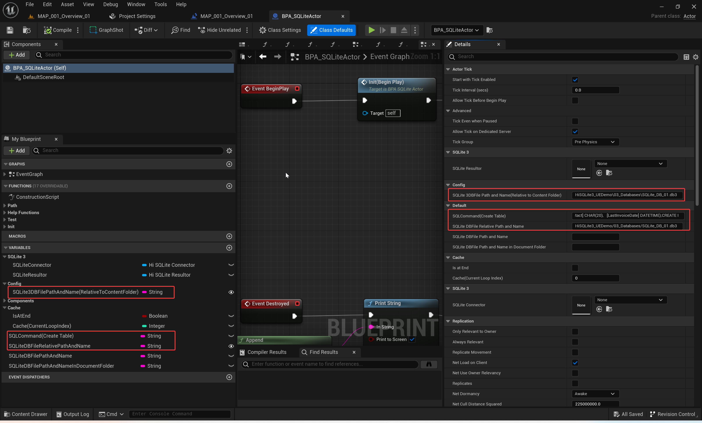
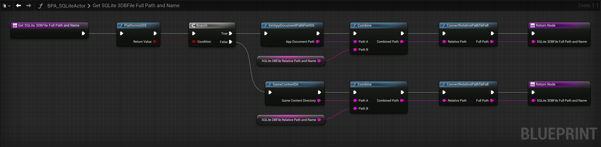

**Note:** There is a bug with the github DownloadZIP(".map" asset file are Git LFS file, Github DownloadZIP results in the ".map" file only 1KB).  **You should clone this repository by HTTPs of this git, Not by Github DownloadZIP.**

# Product Title：

**HiSQLite3 (SQLite3 Blueprint For UE5)**

**UE Marketplace:** 

# Short Description：

New fully reimplemented in UE5, supports all target platforms. This UE5 plugin lets your UE project easily read and write SQLite3 database files. Only need to use the Blueprint Functions, you can easily execute the SQLite3 database's CRUD(Create, Retrieve, Update, and Delete) operations. The **free UE4 version** is:https://shorturl.at/euBMT

# Long Description：

**Note**, this is the new **UE5 version**. The **free UE4 version** is: https://www.unrealengine.com/marketplace/en-US/product/hisqlite3-sqlite3-for-ue4

**This is a UE C ++ plugin that lets your UE project easily read and write SQLite3 database files.** 

**Only need to use the Blueprint Functions, you can easily execute the SQLite3 database's CRUD(Create, Retrieve, Update, and Delete) operations.** 

**This plugin supports all target platforms, such as:** Win64, Mac, iOS, Android, Linux, TVOS, and HoloLens Systems.

**Features:** 

- Only Blueprint Needed: Only need to use the Blueprint Functions, you can easily execute the SQLite3 database's CRUD(Create, Retrieve, Update, and Delete) operations.
- Supports all target platforms.

# Blueprint nodes overview of "HiSQLite3(UE5)"

**Level Blueprint Of This Map**:'./HiSQLite3_UEDemo/01_Maps/MAP_001_Overview_01'

## Detailed description of each node

### SQLiteConnector Functions:

**"1"**: **CreateSQLiteConnector**, First, call "CreateSQLiteConnector()" to create the "SQLiteConnector" Object.

**"2"**: **Close**, Closes the database handle and unlocks the file.

**"3"**: **GetLastErrorInfo**, Use this HiSQLiteConnector to get last error info.

**"4"**: **Open**, Open a SQLite file. ConnectionString: Path to the file that should be opened. OpenMode: Modes used when opening a database.

**"5"**: **Execute(No RecordSet)**

> 	Execute a command on the database without storing the result set (if any).
> 	@param CommandString		Command to execute
> 	@return true if execution was successful, false otherwise

**"6"**: **Execute(With RecordSet)**

> 	Executes the command string on the currently opened database, returning a HiSQLiteResultor.
> 	@param CommandString	Command to execute
> 	@return NewSQLiteResultor UHiSQLiteResultor that is going to hold result
> 	@return true if execution was successful, false otherwise

### SQLiteResultor Functions

**"1"**: **GetColumnInfos**, Returns the set of column infos(Containing: column name, column data type) for this Recordset.	This is useful for determining what you can actually ask the record set for without having to hard code those ahead of time.

**"2"**: **GetRecordCount**, Returns a count of the number of records in the record set.

**"3"**: **IsAtEnd**, Returns whether we are at the end. Return true if at the end, false otherwise.

**"4"**: **MoveToFirst**, Moves to the first record in the set.

**"5"**: **MoveToNext**, Moves to the next record in the set.

**"6"**: **GetString**, Returns a string associated with the passed in column name for the current row. Column: Name of column to retrieve data in current row.

**"7"**: **GetInt**, Returns an integer associated with the passed in column name for the current row. Column: Name of column to retrieve data in current row.

**"8"**: **GetBigInt**, Returns a int64 associated with the passed in column name for the current row. Column: Name of column to retrieve data in current row.

**"9"**: **GetFloat**, Returns a float associated with the passed in column name for the current row. Column: Name of column to retrieve data in current row

**"10"**: **SQLiteResultorToTable**, Used to obtain column and row information in the database. "**SQLiteResultorToTable()**" is in the "BFL_HiSQLite3" of "HiSQLite3" plugin conent.

**"11"**: **BPS_SQLiteTable Struct Type**, contains column and row information of the database Table.

### SQLite3 Database "File" Processing Functions

**"1"**: **CopyFile**, Copies a file.

**"2"**: **FileExists**, Notice: for iOS, please use the "FileExistsForIOS" instead. Return true if this file was found, false otherwise.

**"3"**: **MoveFile**, Moves/renames a file.

**"4"**: **CopyFileForIOS**, Notice: for iOS, please use this "CopyFileForIOS()". 

**"5"**: **FileExistsForIOS**, Notice: for iOS, please use this "FileExistsForIOS()". Return true if this file was found, false otherwise.

**"6"**: **MoveFileForIOS**, Moves/renames a file. Notice: for iOS, please use this "MoveFileForIOS()". 

**"7"**: **DeleteFile**, Deletes a file.

### SQLite3 Database "File  Path" Processing Functions

**"1"**: **PlatformIsIOS**, return true if Platform is iOS.

**"2"**: **CreateSQLiteConnector**,  First, call "CreateSQLiteConnector()" to create the "SQLiteConnector" Object.

**"3"**: **GetGameName**, Gets the name of the currently running game. Return The game name.

**"4"**: **GameContentDir**, Returns the content directory of the current game by looking at FApp::GetGameName(). Notice: For iOS, Please use the "GameContentDirForIOS()" instead. Return content directory.

**"5"**: **GameDir**

>     Returns the base directory of the current game by looking at FApp::GetGameName().
>     This is usually a subdirectory of the installation
>     root directory and can be overridden on the command line to allow self
>     contained mod support.
>     
>     Notice: For iOS, Please use the "GetAppPathForIOS" instead.
>     
>     Return base directory

**"6"**: **GetAppResourcePathForIOS**, Notice: The path and file name for iOS is case-sensitive.

**"7"**: **Combine**, Combine two or more paths into one single path.

**"8"**: **ConvertRelativePathToFull**, Converts a relative path name to a fully qualified name relative to the process BaseDir().

**"9"**: **GameContentDirForIOS**, Returns the content directory of the current game for iOS. Notice: The path and file name for iOS is case-sensitive. Return content directory.

**"10"**: **DirectoryExists**, Return true if this directory was found, false otherwise.

**"11"**: **GetAppDocumentPathForIOS**, Notice: The path and file name for iOS is case-sensitive.

**"12"**: **GetAppPathForIOS**, Notice: The path and file name for iOS is case-sensitive.

# Example Introduction

**SQLite3 Database file path**: "\Content\HiSQLite3_UEDemo\03_Databases\SQLite_DB_01.db3"

You can use "**SQLiteStudio**" to view and edit the ".db3" database file: https://sqlitestudio.pl/

**Example Actor**: `'./HiSQLite3_UEDemo/02_Assets/01_BPs/01_BPAs/BPA_SQLiteActor'`

**Example Result:**

## Steps:

### 01: First, call "CreateSQLiteConnector()" to create the "SQLiteConnector" Object.

### 02: Open the DataBase file.

### 03: Execute DataBase Commands.

### 04: Iterate over the data in the SQLiteResultor” Object. Obtain data from the “SQLiteResultor” Object.

### 05: "SQLiteResultorToTable()": Used to obtain column and row information in the database.

"**SQLiteResultorToTable()**" is in the "BFL_HiSQLite3" of "HiSQLite3" plugin conent.

**"BFL_HiSQLite3"**: '/HiSQLite3/02_Assets/01_BPs/01_BFLs/BFL_HiSQLite3'

